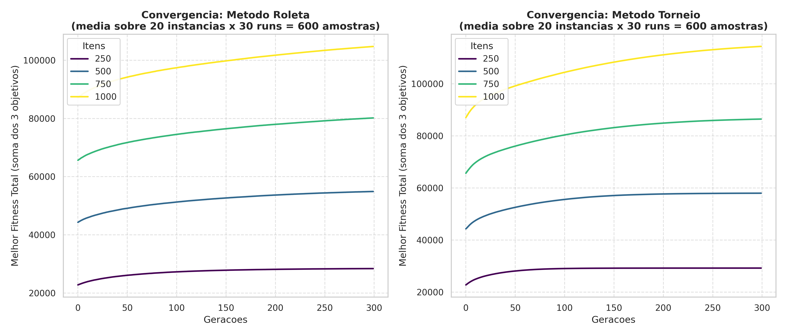
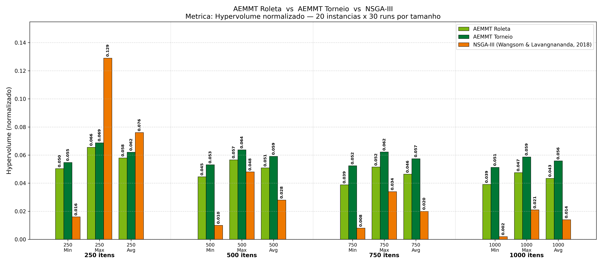

# AEMMT: Multi-Objective Knapsack Problem Solver


## Overview

AEMMT (*Algoritmo Evolutivo de Múltiplas Subpopulações*, or Multi-Population Evolutionary Algorithm) is a genetic algorithm written in C++17 designed to solve the Multi-Objective 0/1 Knapsack Problem (MOKP).

The MOKP is a classic NP-hard combinatorial optimization problem. Given $m$ items and $n$ objectives (knapsacks), each item $j$ has a weight $w_j$ and a profit $p_{ij}$ for each objective $i$. The goal is to find a binary selection vector $x = (x_1, x_2, \ldots, x_m) \in \{0,1\}^m$ that simultaneously maximizes all profit objectives without exceeding the knapsack capacity $c$:

$$\text{maximize} \quad f(x) = \bigl(f_1(x),\, f_2(x),\, \ldots,\, f_n(x)\bigr)$$

$$\text{where} \quad f_i(x) = \sum_{j=1}^{m} p_{ij} \cdot x_j \quad \text{subject to} \quad \sum_{j=1}^{m} w_j \cdot x_j \leq c$$

The multi-objective nature of the problem means there is no single optimal solution, but rather a set of trade-off solutions known as the Pareto front, i.e., solutions where no objective can be improved without degrading at least one other.

The algorithm is compared against NSGA-III results from the scientific literature (Wangsom & Lavangnananda, 2018), following the same instance generation protocol, problem sizes, and number of runs to keep the comparison methodologically sound.

## Directory Structure

```
matsmoraes-aemmt/
├── main.cpp                     # AEMMT solver (death penalty constraint handling)
├── generate_instances.cpp       # Fixed instance generator (20 instances x 4 sizes)
├── plot_convergence.py          # Convergence visualization (fitness over generations)
├── plot_final_cpp.py            # Hypervolume comparison: AEMMT vs NSGA-III
├── plot_reparo_vs_semreparo.py  # Hypervolume comparison: with repair vs without repair
└── instances/                   # 80 pre-generated fixed CSV instances
    ├── mokp_250_inst01.csv
    ├── ...
    └── mokp_1000_inst20.csv
```

## Algorithm Design

### Sub-Populations per Objective

The total population of 90 individuals is split into 3 sub-populations of 30, each dedicated to one of the three knapsack objectives. Rather than applying the same generic selective pressure to every individual, each group evolves under pressure tuned to its own objective, i.e., each sub-population optimizes for a single $f_i(x)$ during selection. This pushes the search toward extreme regions of the Pareto front and improves solution diversity across the three objectives.

### Constraint Handling: Death Penalty

Any solution whose total weight exceeds the knapsack capacity $c$ receives a fitness of zero across all objectives and is marked as infeasible. Formally, the evaluated fitness vector $F(x)$ is defined as:

$$F_i(x) = \begin{cases} f_i(x) & \text{if } \displaystyle\sum_{j=1}^{m} w_j \cdot x_j \leq c ,\\ 0 & \text{otherwise} \end{cases}$$

This is the same strategy implicitly used by NSGA-III in the reference study, which makes the comparison between the two algorithms direct and fair.

```cpp
if (ind.total_weight > max_capacity) {
    fill(ind.fitness, ind.fitness + NUM_OBJECTIVES, 0.0);
    ind.feasible = false;
}
```

### Selection

Two methods are implemented and compared:

**Roulette Wheel Selection** picks individuals with probability proportional to their fitness value. It works well in early generations but loses discriminatory power as the population converges, i.e., when individuals start presenting numerically similar fitness values and the fitness proportions between them become nearly equal.

**Binary Tournament (k=2)** draws two individuals at random and selects the fitter one. Because the decision is based on relative ranking rather than absolute fitness magnitude, i.e., it only matters who is better, not by how much, the method maintains consistent selective pressure throughout all 300 generations. Tournament outperformed roulette in every problem size tested.

### Crossover and Mutation

One-point crossover splits the parent chromosomes at a random position and swaps the segments to produce two offspring. It is applied at a 100% rate to every selected pair.

Mutation uses bit-flip with probability $P_m = 1/N$, where $N$ is the number of items. On average, this flips exactly one gene per individual regardless of problem size, keeping exploration stable from 250 to 1000 items.

### Elitism

Before each generation is replaced, the best feasible individual from each sub-population is saved, i.e., 3 individuals in total, one per objective. After the 90 offspring are generated, the 3 worst are replaced by these elite individuals. This gives an elitism rate of 3.33% (3/90) and prevents good solutions from being lost in the full generational replacement.

## Experimental Setup

### Fixed Instances

To ensure reproducibility and alignment with the reference study, 20 fixed instances were pre-generated for each of the 4 problem sizes, giving 80 instances in total. Each is stored as a CSV file in the `instances/` folder and loaded by the solver at runtime.

Generation follows the protocol of Zitzler & Thiele (1998), replicated by Wangsom & Lavangnananda (2018): item weights and profits are drawn uniformly from $[10, 100]$, and the knapsack capacity is set to 50% of the total weight. Each instance uses a deterministic seed so the same files are always produced, i.e., re-running `gen_instances` always yields the exact same 80 instances.

### Benchmark Parameters

| Parameter | Value |
|---|---|
| Problem sizes | 250, 500, 750, 1000 items |
| Objectives | 3 |
| Instances per size | 20 |
| Runs per instance | 30 |
| Generations | 300 |
| Population size | 90 (3 sub-populations of 30) |
| Elitism | 3.33% (1 per sub-population) |
| Mutation rate | 1/N |
| Crossover rate | 100% |
| Constraint handling | Death Penalty (fitness = 0) |

## Prerequisites

You will need GCC/G++ with C++17 support. On Linux and macOS the standard `build-essential` package covers this. On Windows, MinGW or Visual Studio Build Tools work fine.

For the Python scripts, install the dependencies with:

```bash
pip install pandas matplotlib seaborn numpy pymoo
```

## How to Run

**Step 1: Generate the fixed instances**

```bash
g++ generate_instances.cpp -o gen_instances -O2 -std=c++17
./gen_instances
```

This creates the `instances/` folder with all 80 CSV files. You only need to run this once.

**Step 2: Run the benchmark**

```bash
g++ main.cpp -o benchmark_app -O3 -std=c++17
./benchmark_app
```

This generates two output files: `fronteira_pareto_completa.csv` with the Pareto front solutions per run, and `evolucao_fitness.csv` with the fitness evolution per generation.

**Step 3: Plot convergence**

```bash
python plot_convergence.py
```

Output: `analise_convergencia.png`

**Step 4: Hypervolume comparison (AEMMT vs NSGA-III)**

```bash
python plot_final_cpp.py
```

Output: `comparacao_final_hv_todos.png`

This plots AEMMT Roleta, AEMMT Torneio, and NSGA-III side by side for all four problem sizes.

## Results

### Convergence



Both selection methods show a steady increase in best total fitness over 300 generations. Each point in the chart is the average over 20 instances and 30 runs, i.e., 600 samples per point. Tournament selection converges faster and reaches higher fitness values, with the gap becoming more visible at larger problem sizes.

### Hypervolume: AEMMT vs NSGA-III



AEMMT with Tournament selection outperforms NSGA-III in minimum and average Hypervolume across all problem sizes. The advantage grows with problem complexity: at 1000 items, Tournament achieves an average HV of 0.056 against NSGA-III's 0.014. Beyond the raw numbers, AEMMT also shows much lower variance between minimum and maximum values, i.e., the algorithm behaves consistently across different instances rather than occasionally finding a good solution by chance.

## Methodological Notes

It is worth noting that NSGA-III relies on nondominated sorting as an implicit elitism mechanism, which is structurally stronger than the 3.33% explicit elitism used here. The comparison does not favor AEMMT through over-elitism. Additionally, both algorithms use death penalty for infeasible solutions, which isolates the contribution of the evolutionary architecture itself rather than the constraint handling strategy.

## References

1. Deb K, Jain H (2014). An Evolutionary Many-Objective Optimization Algorithm Using Reference-Point-Based Nondominated Sorting Approach. *IEEE Transactions on Evolutionary Computation* 18(4): 577-601.
2. Ishibuchi H, Imada R, Setoguchi Y, Nojima Y (2016). Performance comparison of NSGA-II and NSGA-III on various many-objective test problems. *2016 IEEE Congress on Evolutionary Computation (CEC)*, pp. 3045-3052.
3. Wangsom P, Lavangnananda K (2018). Extreme Solutions NSGA-III (E-NSGA-III) for Multi-Objective Constrained Problems. *2018 10th International Conference on Knowledge and Smart Technology (KST)*, Chiang Mai, Thailand, pp. 1-6.
4. Zitzler E, Thiele L (1998). Multiobjective Evolutionary Algorithms: A Comparative Case Study and the Strength Pareto Approach. *IEEE Transactions on Evolutionary Computation* 2(4): 257-271.
5. Brasil C R S (2012). *Algoritmo evolutivo de muitos objetivos para predicao ab initio de estrutura de proteinas*. PhD Thesis, Universidade de Sao Paulo, Sao Carlos, Brazil.
6. De Jong K (2006). *Evolutionary Computation: A Unified Approach*. MIT Press.

## Authors

**Matheus de Moraes Neves** and **Christiane Regina Soares Brasil (Scientific Initiation advisor)**
Universidade Federal de Uberlandia (UFU)

- [LinkedIn](https://www.linkedin.com/in/matheus-neves-864aa01a8/)

*Developed as part of a Scientific Initiation research project on Combinatorial Optimization and Evolutionary Algorithms.*
